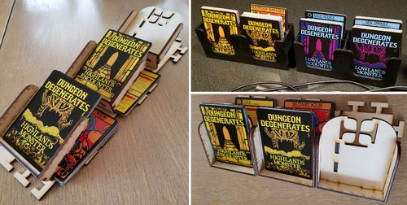
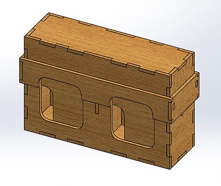

# Card Holders

These are various files for printing trays or boxes for holding
**Dungeon Degenerates** cards during play to reduce the amount of table
space needed.  (They should work for other standard-sized cards too.)
If you’re looking for an organizer to fit in the box, this isn’t it.

All of these files assume you're cutting them out of material which is
1/8" thick.  (I used plywood.)

**Note** that in the SVG files below, I think the lines are 0.001" thick
because that's how the laser cutter at my son's school decided they were
*cuts* instead of *lines.*  In order to see anything, you may need to
select everything and change the stroke width to 0.01".

## Double boxes

Each box has space for a draw & discard pile for two decks of cards.

[Assembly instructions](instructions-double-box.md)

* **[card-holder-double-box-max-layout.svg](card-holder-double-box-max-layout.svg)**
  contains six boxes, intended for an 18" x 24" sheet.
* **[card-holder-double-box.svg](card-holder-double-box.svg)** contains
  one box, intended for an 8.5" x 11" sheet.  (I'm not *totally*
  positive these parts are interchangeable with parts from
  card-holder-double-box-max-layout.svg, but if you print that one, you
  shouldn't need this one.)
* **[card-holder-double-box-0.5mm.dxf](card-holder-double-box-0.5mm.dxf)**
  is a DXF version of that file, saved by Inkscape, because apparently
  SolidWorks didn't like the SVG files.  (Opening it in Inkscape again,
  it looks a little goofed up, but I don't know enough about these tools
  or file formats to know whether that's a problem.)

## Double box lids

My thinking here was that you could preserve your campaign state by just
putting lids on the deck boxes.  I haven't actually been able to test
this yet, so it may have errors (although my brother did some fitment
test in SolidWorks, and said it was fine).

* **[card-holder-double-box-lid-only.svg](card-holder-double-box-lid-only.svg)**
  contains one lid, intended for an 8.5" x 11" sheet.

Rendered box with lid (from [Ken](https://www.kbcad.engineering/)):

## Single boxes

Each box has space for a draw & discard pile for one deck of cards.

* **[card-holder-box.svg]()** contains one poorly-laid-out box.  (I'm
  not *positive* this is the box I printed, but I think it is.  I think
  this was also the first laser-cut thing I ever printed.)

## Trays

Each tray has space for a draw & discard pile for one deck of cards.
The bases interlock, so that you can assemble them into one row or
column of trays along the edge of your board.

* **[card-holder-tray4.svg](card-holder-tray4.svg)** contains one tray,
  laid out horribly wastefully.  This differs from the trays in the
  image above in that the interlocking puzzle-piece bits are shaped more
  like the cross cutout at the top of the tray, just for fun.
