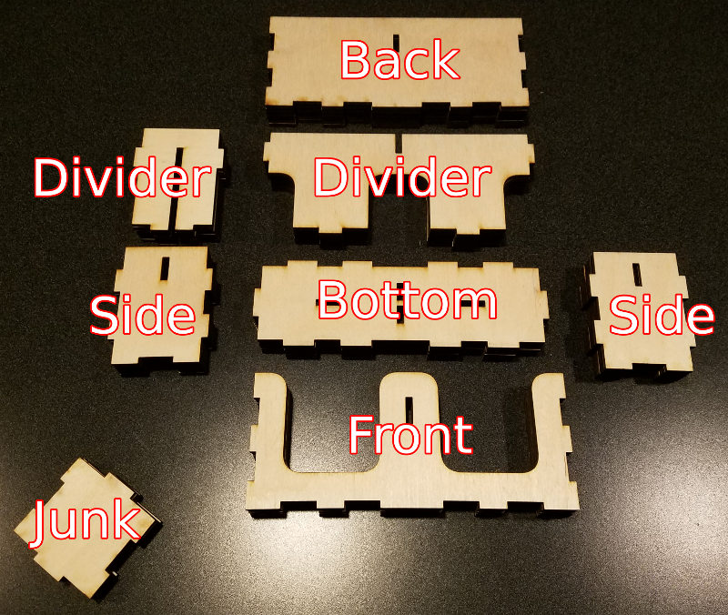
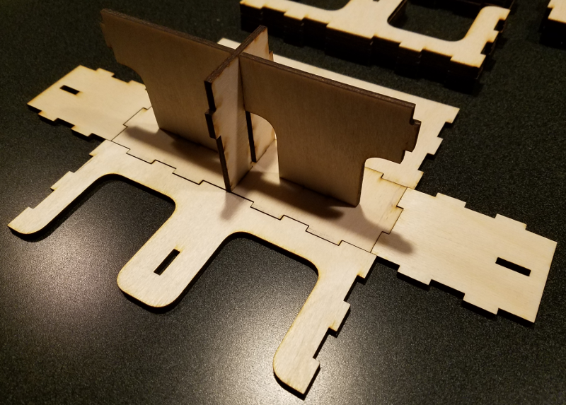
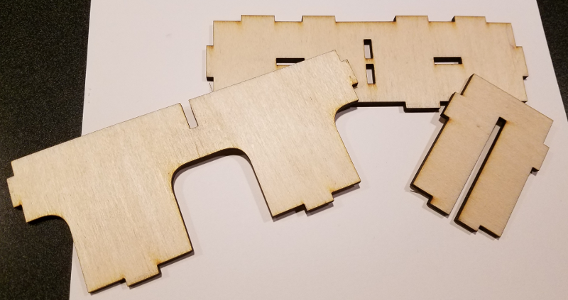
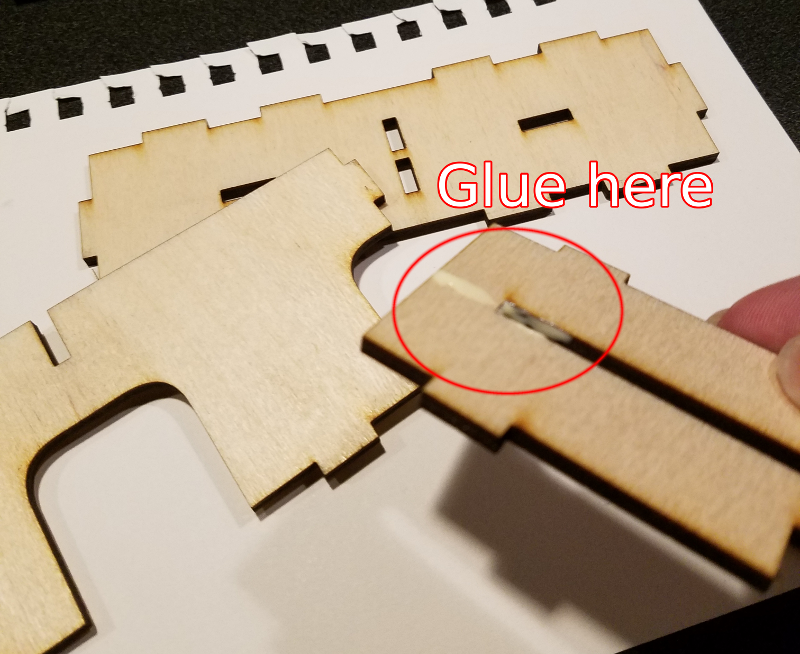
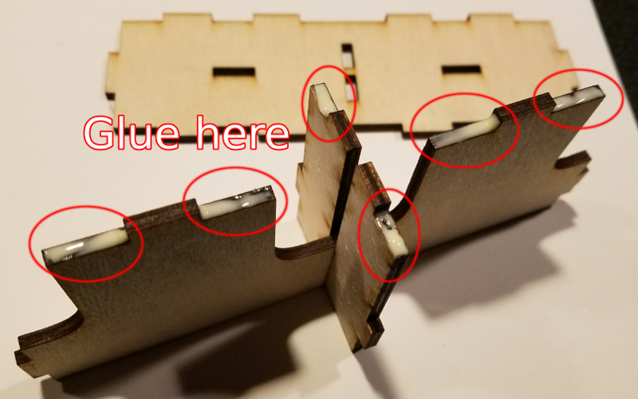
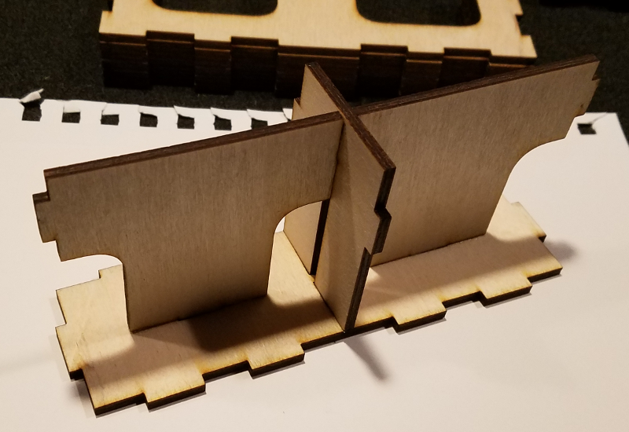
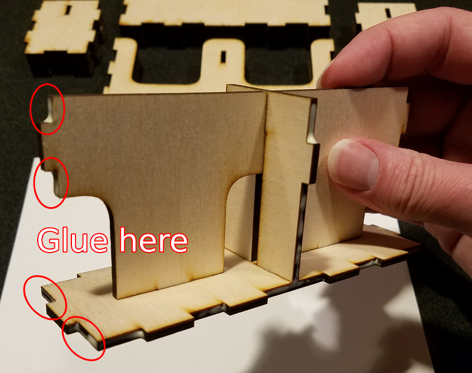
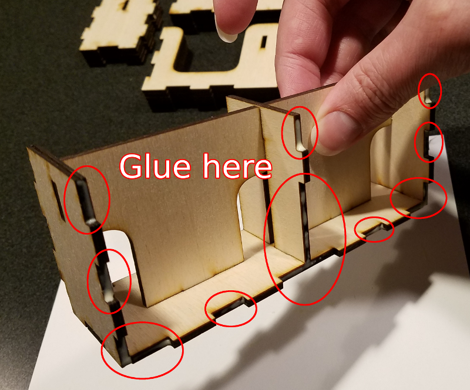
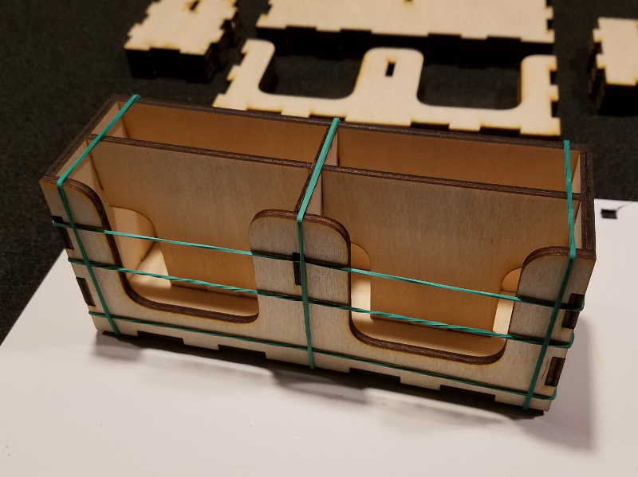

# Assembling a double box

Here are the pieces from card-holder-double-box-max-layout.svg:

Here’s how the pieces are going to fit together:

This is going to be done in two phases.  First, you’re doing the
dividers & bottom:

Attach the dividers to each other.  Apply glue and slide them together:

Then glue the dividers to the bottom:

That should look like this:

Put a heavy book on top to keep everything pressed in place and let it
dry.

**In the second phase,** you’re going to attach the front, back, and
sides.  First, glue on one of the sides:

(In that picture, I’ve got glue on other areas, but that’s because I was
overly enthusiastic.)

After gluing on one side, glue the other side on too.  Then, you’re
going to do the front:

Repeat that to attach the back.  Then use rubber bands to keep things
together while it dries:

After that, you’re on to painting!